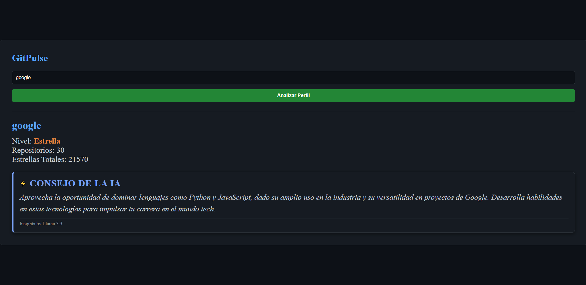

# 🚀 GitPulse: AI Developer Insights

Este es un proyecto profesional desarrollado con **FastAPI** y **Llama 3.3 (IA)**. Permite analizar perfiles de GitHub en tiempo real y obtener consejos personalizados mediante inteligencia artificial.

## 🔗 Enlace al Proyecto:
- https://gonzardev-gitpulse.hf.space

## ✨ Características
- **Análisis IA:** Integración con modelos de lenguaje **Llama 3.3 (vía Groq)** para generar feedback de mentoría.
- **Datos en Tiempo Real:** Conexión directa con la API oficial de GitHub para auditar repositorios y estrellas.
- **Backend:** Construido con FastAPI y HTTPX para un rendimiento superior.
- **Seguridad:** Manejo profesional de variables de entorno para la protección de claves de API.
- **Frontend:** Interfaz moderna, minimalista y responsive.

## 🛠️ Tecnologías
- **Backend:** Python, FastAPI, Groq Cloud API, HTTPX.
- **Frontend:** HTML, CSS, JavaScript.
- **Despliegue:** Hugging Face (Docker).

## 📸 Capturas

